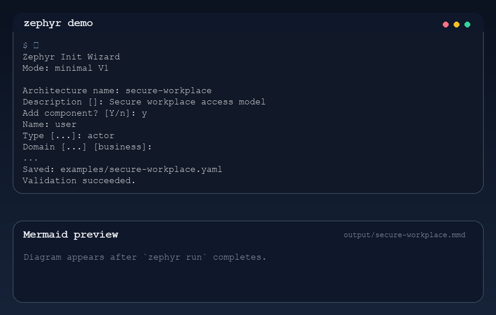
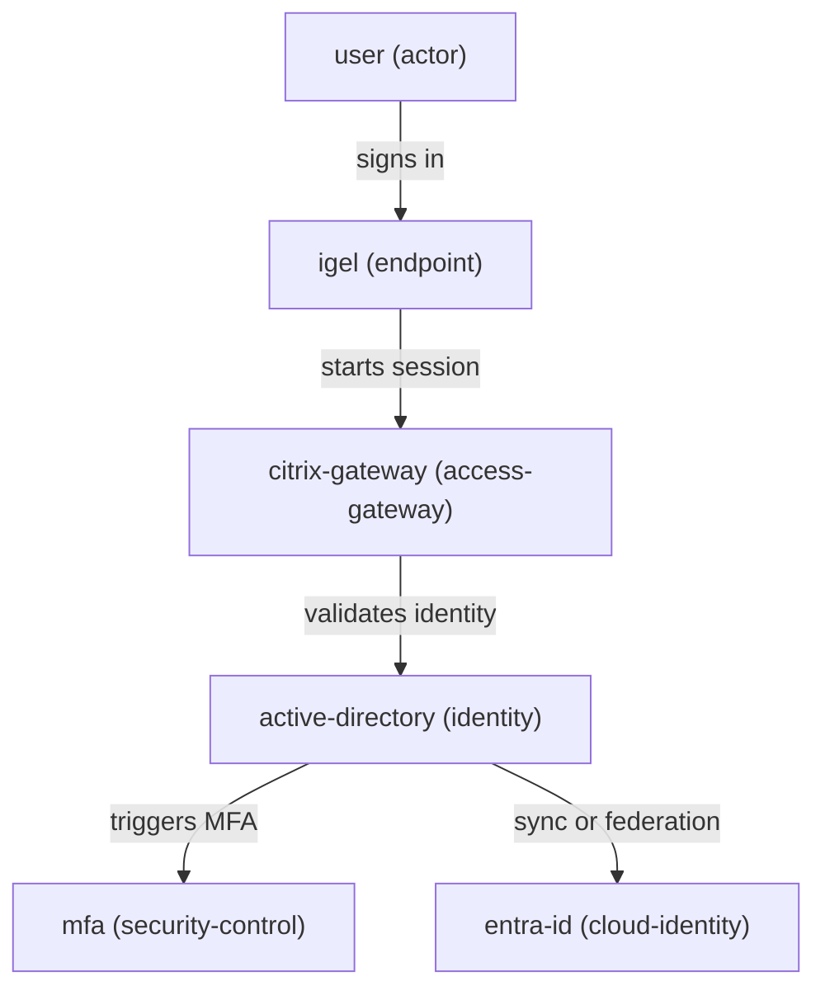
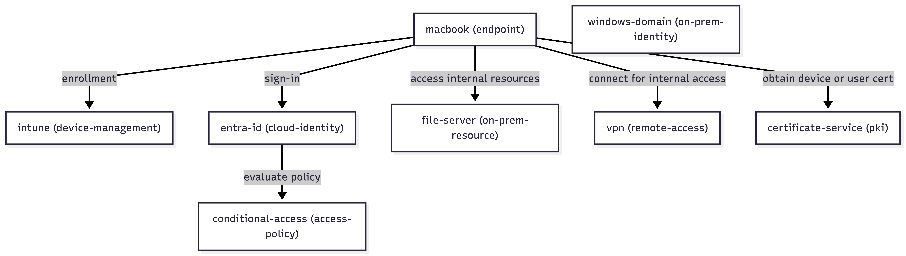

# zephyr-workbench


> **Model infrastructure. Understand flows. Generate architecture.**

CLI-based architecture workbench for modeling **infrastructure, identity, and workplace systems** using YAML, validation, summaries, and diagrams.

---

## ⚡ V1 at a glance

The first version is intentionally small and practical:

* YAML in
* validation first
* warnings for risky architecture patterns
* text summary out
* Mermaid diagram out
* CLI first

---

## 🧠 What it does

Zephyr Workbench helps you:

* describe infrastructure systems in a structured format
* analyze components, flows, and risks
* validate architecture models before rendering
* generate architecture summaries
* produce diagram-ready output

It is designed for real-world architecture work where identity, endpoints, trust boundaries, and dependencies matter.

---

## 🚀 Quick start

```bash
python3.11 -m venv .venv
source .venv/bin/activate
python -m pip install -e ".[dev]"
python -m zephyr.cli init --minimal
python -m zephyr.cli validate examples/macos-intune-windows-domain.yaml
python -m zephyr.cli summary examples/macos-intune-windows-domain.yaml
python -m zephyr.cli summary examples/macos-intune-windows-domain.yaml --json
python -m zephyr.cli diagram examples/macos-intune-windows-domain.yaml --format mermaid
python -m zephyr.cli run examples/macos-intune-windows-domain.yaml
```

`zephyr init --minimal` is the fastest V1 path. It asks only for core metadata, components, flows, and risks, while filling the rest with sensible defaults.

`zephyr run` is the fastest end-to-end path. It validates the model, prints the summary, and writes a Mermaid diagram to `output/`.

---

## 🎥 Demo



Minimal init, end-to-end run, and diagram preview in one short terminal flow.

---

## 📐 V1 model contract

Zephyr V1 accepts a YAML mapping with these top-level fields:

* `name` required string
* `description` optional string
* `components` required list
* `flows` required list
* `risks` optional list

Each component must have:

* `name`
* `type`

Each flow must have:

* `from`
* `to`
* optional `label`

Each risk must have:

* `id`
* `title`
* `severity`

Validation rules enforced by the CLI:

* component names must be unique
* risk IDs must be unique
* flows must point to known components
* component types must be from the V1 allowlist
* risk severity must be one of `low`, `medium`, `high`, `critical`

Smart validation warnings currently include:

* endpoint-to-endpoint flows
* MFA flows that do not terminate in an identity component
* single access-gateway designs that look like a single point of failure

The current machine-readable contract lives in `schemas/architecture.schema.yaml`.

---

## 🔥 Example output

```text
Warnings:
- W1: only one access-gateway detected (citrix-gateway)

Validation passed with warnings

Architecture: secure-workplace
Components: 6
Flows: 5
Risks: 2

Risks:
- [HIGH] R1: Citrix Gateway single point of failure
- [MEDIUM] R2: MFA dependency not clearly documented

Diagram generated: output/secure-workplace.mmd
```

---

## 🎬 Turn models into diagrams

```bash
python -m zephyr.cli diagram examples/secure-workplace.yaml --format mermaid
```



---

## 🧠 Why Zephyr

Architecture is usually:

* fragmented across slides and diagrams
* inconsistent between teams
* hard to reason about and reuse

**Zephyr makes architecture executable.**

Define once, then validate, analyze, visualize, and reuse.

---

## 🧪 Real-world example

The strongest current demo path is the enterprise hybrid macOS example:

```bash
python -m zephyr.cli run examples/macos-intune-windows-domain.yaml
```

Models:

* macOS devices enrolled in Intune
* Entra ID identity flows
* Conditional Access
* VPN and certificate-based access
* on-prem Windows domain integration

Expected summary shape:

```text
Architecture: macos-intune-windows-domain
Components: 8
Flows: 6
Risks: 3
```

Built for **real enterprise environments**, not abstract diagrams.

---

## 📦 Core model

Zephyr uses a simple structure:

* `components` for systems, endpoints, identities, and controls
* `flows` for interactions and dependencies
* `risks` for weaknesses and failure points

Input: YAML
Output: structured, repeatable architecture data

---

## 🧰 Scope (V1)

| Input | Output |
| --- | --- |
| YAML architecture models | Text summaries |
| YAML architecture models | JSON summaries |
| Structured components and flows | Mermaid diagrams |
| One CLI command | Validate, summarize, and diagram |
| Invalid models | Clear validation errors |

**Approach**

* CLI-first
* simple, inspectable files
* practical architecture modeling over UI complexity

---

## 🏗️ Project structure

```text
zephyr/      CLI and core logic
examples/    sample architectures
schemas/     model reference
tests/       validation and checks
```

---

## 🧭 Philosophy

* model first, diagram later
* structure over slides
* simplicity over abstraction
* built for real operations

---

## 📄 Status

Early V1.

Current focus:

* stabilizing the V1 model contract
* expanding validation coverage
* improving summary and diagram output

---

## 📄 License

MIT

### Architecture preview

From model → validated → visualized:


