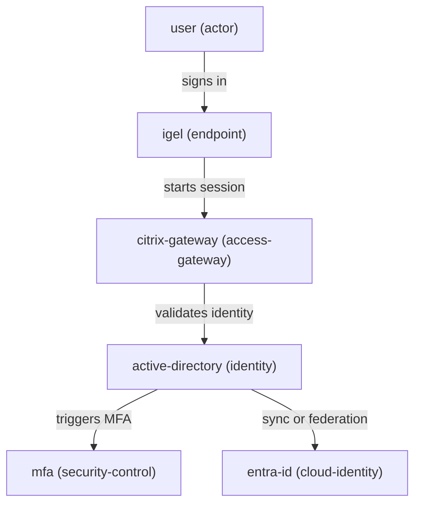

# zephyr-workbench

**CLI-based architecture workbench for modeling infrastructure, identity, and workplace systems using YAML — and turning them into summaries and diagrams.**

---

## ⚡ Why this exists

Architecture work is often scattered across:
- slides
- diagrams
- notes
- tribal knowledge

**Zephyr turns architecture into a structured, executable model.**

👉 Describe systems once → generate summaries, flows, and diagrams consistently.

---

## 🧠 What it does

Zephyr lets you:

- model infrastructure and identity systems in YAML
- define components, flows, and risks
- generate architecture summaries
- output diagram-ready Mermaid graphs

Built for **real-world environments** where:
- identity flows matter
- endpoints are complex
- trust boundaries are critical

---

## 🚀 Quick start

```bash
python3.11 -m venv .venv
source .venv/bin/activate

pip install -e .

python -m zephyr.cli summary examples/secure-workplace.yaml
python -m zephyr.cli diagram examples/secure-workplace.yaml --format mermaid
```

---

## 🔥 Example output

```
Architecture: secure-workplace
Components: 6
Flows: 5
Risks: 2

Risks:
- [HIGH] R1: Citrix Gateway single point of failure
- [MEDIUM] R2: MFA dependency not clearly documented
```

---

## 🎬 Mermaid output



---

## 📦 Core model (V1)

Zephyr uses a simple architecture model:

- **components** — systems, identities, endpoints, services
- **flows** — interactions between components
- **risks** — identified weaknesses or dependencies

Input is plain YAML. Output is structured and repeatable.

---

## 🧪 Real-world example

Included example:

```bash
python -m zephyr.cli summary examples/macos-intune-windows-domain.yaml
python -m zephyr.cli diagram examples/macos-intune-windows-domain.yaml --format mermaid
```

Models:

- macOS devices enrolled in Intune
- Entra ID identity flows
- Conditional Access
- VPN and certificate-based access
- On-prem Windows domain integration

👉 This is where Zephyr is strongest.

---

## 🧰 Scope

**Input**
- YAML architecture definitions

**Output**
- text summaries
- Mermaid diagrams

**Approach**
- CLI-first
- simple files
- no UI overhead

---

## 🏗️ Project structure

```
zephyr/      CLI and core logic
examples/    sample architectures
schemas/     V1 model reference
tests/       validation and behavior checks
```

---

## 🧭 Philosophy

- Model first, diagram later
- Keep systems understandable
- Prefer structure over slides
- Build for real operations, not theory

---

## 📄 Status

Early V1.

Focus:
- validation
- stable CLI
- better summaries and diagrams

---

## 📄 License

MIT# zephyr-workbench

> Architecture workbench for modeling, analyzing, and visualizing infrastructure systems and flows.

Turn architecture ideas into structured models, summaries, and diagram-ready output.

---

## ⚡ V1 at a glance

The first version is intentionally small and practical:

* YAML in
* text summary out
* Mermaid diagram out
* CLI first

---

## 🧠 What it does

Zephyr Workbench helps you:

* describe infrastructure systems in a structured format
* analyze components, flows, and risks
* generate architecture summaries
* produce diagram-ready output

It is designed for real-world architecture work where identity, endpoints, trust boundaries, and dependencies matter.

---

## 🚀 Quick start

```bash
python3.11 -m venv .venv
source .venv/bin/activate
python -m pip install -e .
python -m zephyr.cli summary examples/secure-workplace.yaml
python -m zephyr.cli diagram examples/secure-workplace.yaml --format mermaid
```

---

## 🔥 Example output

```text
Architecture: secure-workplace
Components: 6
Flows: 5
Risks: 2

Risks:
- [HIGH] R1: Citrix Gateway single point of failure
- [MEDIUM] R2: MFA dependency not clearly documented
```

---

## 🎬 Mermaid example

```text
graph TD
    user["user (actor)"]
    igel["igel (endpoint)"]
    citrix_gateway["citrix-gateway (access-gateway)"]
    active_directory["active-directory (identity)"]
    entra_id["entra-id (cloud-identity)"]
    mfa["mfa (security-control)"]
    user -->|signs in| igel
    igel -->|starts session| citrix_gateway
    citrix_gateway -->|validates identity| active_directory
    active_directory -->|triggers MFA| mfa
    active_directory -->|sync or federation| entra_id
```

---

## 🧰 Current scope

### Input

* YAML architecture definitions

### Output

* text summaries
* Mermaid diagrams

### Approach

* CLI first
* simple, inspectable files
* practical architecture modeling over UI complexity

---

## 📁 Project structure

```text
zephyr/      Python package and CLI
examples/    Sample architecture inputs
schemas/     Human-readable V1 schema reference
docs/        Reserved for rendered outputs and diagrams
tests/       Lightweight checks
```

---

## 🧪 Example use cases

* model a secure workplace architecture
* describe identity and access flows
* identify dependencies and risks
* generate first-pass architecture summaries
* prepare systems for diagramming and documentation
* model macOS management in Windows-based enterprise environments
* map Intune-enrolled macOS devices across Entra ID, compliance, and on-prem resources

---

## 🏢 Real-world focus

A strong target use case for Zephyr Workbench is enterprise macOS management in Microsoft-heavy environments.

Example scenarios include:

* Intune-enrolled macOS devices
* Entra ID identity flows
* access to on-prem Windows domain resources
* Conditional Access and compliance dependencies
* certificates, VPN, and secure access paths

This makes Zephyr useful for modeling hybrid workplace architecture, not just abstract system diagrams.

---

## 🧩 Enterprise macOS example

The repository now includes a first real-world hybrid example:

```bash
python -m zephyr.cli summary examples/macos-intune-windows-domain.yaml
python -m zephyr.cli diagram examples/macos-intune-windows-domain.yaml --format mermaid
```

This example models a macOS device enrolled in Intune, authenticated through Entra ID, evaluated by Conditional Access, and reaching internal resources through VPN and certificate-backed access.

---

## 🧭 Why

Architecture work often ends up spread across notes, documents, and diagrams.

Zephyr Workbench is an attempt to make that work more structured, repeatable, and tool-friendly.

Instead of starting with slides, Zephyr starts with a simple model.

---

## 📄 Status

Early V1.

Current focus:

* stabilizing the CLI
* refining the YAML model
* improving summary and diagram output

---

## 📄 License

MIT
