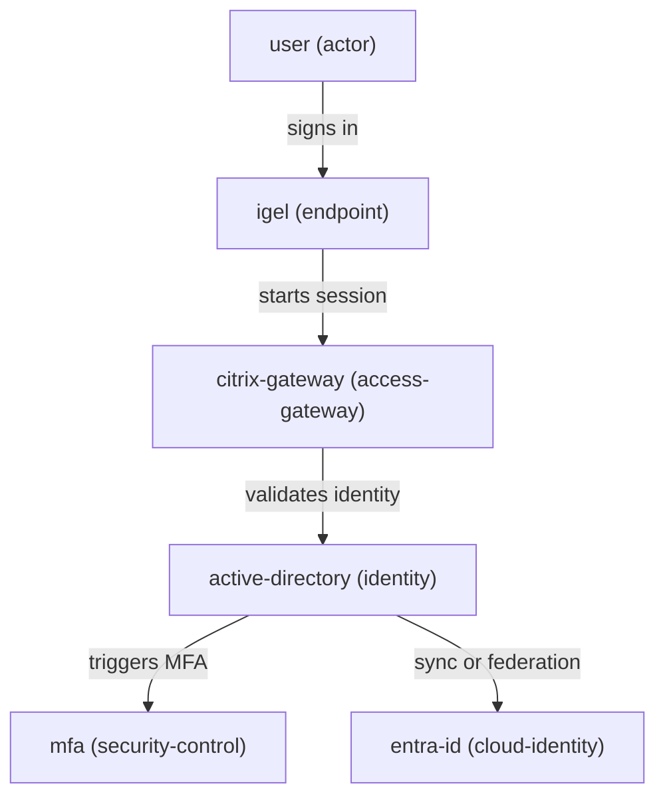

# zephyr-workbench

> **Model infrastructure. Understand flows. Generate architecture.**

CLI-based workbench for modeling **infrastructure, identity, and workplace systems** using YAML — and turning them into **summaries and diagrams**.

---

## ⚡ One command → instant architecture insight

```bash
python -m zephyr.cli summary examples/secure-workplace.yaml
```

```text
Architecture: secure-workplace
Components: 6
Flows: 5
Risks: 2

Risks:
- [HIGH] R1: Citrix Gateway single point of failure
- [MEDIUM] R2: MFA dependency not clearly documented
```

---

## 🎬 Turn models into diagrams

```bash
python -m zephyr.cli diagram examples/secure-workplace.yaml --format mermaid
```



---

## 🧠 Why Zephyr

Architecture is usually:

* fragmented across slides and diagrams
* inconsistent between teams
* hard to reason about and reuse

**Zephyr makes architecture executable.**

👉 Define once → analyze, visualize, reuse

---

## 🚀 Quick start

```bash
python3.11 -m venv .venv
source .venv/bin/activate

pip install -e .

python -m zephyr.cli summary examples/secure-workplace.yaml
python -m zephyr.cli diagram examples/secure-workplace.yaml --format mermaid
```

---

## 🧪 Real-world example (where Zephyr shines)

```bash
python -m zephyr.cli summary examples/macos-intune-windows-domain.yaml
python -m zephyr.cli diagram examples/macos-intune-windows-domain.yaml --format mermaid
```

Models:

* macOS devices enrolled in Intune
* Entra ID identity flows
* Conditional Access
* VPN + certificate-based access
* On-prem Windows domain integration

👉 Built for **real enterprise environments**, not abstract diagrams.

---

## 📦 Core model

Zephyr uses a simple structure:

* **components** → systems, endpoints, identities
* **flows** → interactions and dependencies
* **risks** → weaknesses and failure points

Input: YAML
Output: structured, repeatable architecture data

---

## 🧰 Scope (V1)

| Input                       | Output           |
| --------------------------- | ---------------- |
| YAML architecture models    | Text summaries   |
| Structured components/flows | Mermaid diagrams |

**Approach**

* CLI-first
* simple, inspectable files
* no UI overhead

---

## 🏗️ Project structure

```text
zephyr/      CLI and core logic
examples/    sample architectures
schemas/     model reference
tests/       validation and checks
```

---

## 🧭 Philosophy

* Model first, diagram later
* Structure over slides
* Simplicity over abstraction
* Built for real operations

---

## 📄 Status

Early V1 — actively evolving.

Current focus:

* validation layer
* stable CLI commands
* improved summaries and diagrams

---

## 📄 License

MIT
